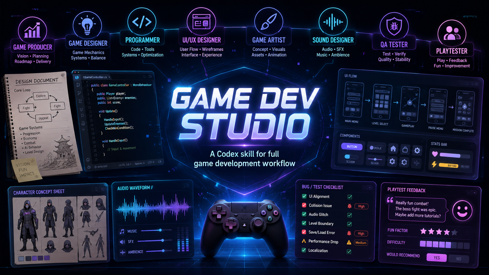

[繁體中文](README.zh-TW.md) | English

# Game Dev Studio Skill

A universal skill that enables Codex / AI Agent to assist in game development as a "complete game development team".

**Current version:** `v0.9.0`

## What is Game Dev Studio?

Game Dev Studio is a skill for AI agents that transforms them into a full game development team. It's not just a code assistant—it's a multi-role team that helps turn vague game ideas into executable plans, technical architectures, visual solutions, and development tasks.

## Quick Start

For routine work, start with a lightweight check:

```txt
$game-dev-studio
Quick Check: Review this upgrade screen and tell me the top three UI or game-feel issues. Keep it short.
```

For broad planning, ask for a full audit:

```txt
$game-dev-studio
Full Studio Audit: I want to make a game. Please help me clarify the direction from producer, game design, programming, UI/UX, art, sound, QA, and playtesting perspectives before writing code.
```

For maturity and next-version decisions, use a roadmap audit:

```txt
$game-dev-studio
Roadmap Strategy Audit: Assess this project's maturity, decide whether to expand or stabilize, and propose the next versions and 30-day priorities. Do not modify files.
```

For client-style production, ask the studio to start with a brief and proposal:

```txt
$game-dev-studio
I am a client commissioning this studio to make a 2D action game. Start with client brief intake, studio proposal, formal art direction, production architecture, MVP scope, and acceptance criteria. Do not write code yet.
```

## Features

- Multi-role collaboration: Producer, Game Designer, Programmer, UI/UX Designer, UI Motion Designer / Game Feel Animator, Gameplay VFX / Technical VFX Designer, Game Artist, Sound Consultant, QA, and Ruthless Playtester
- Supports Unity, Unreal, Godot, HTML Canvas, Web Game, 2D, 3D, and game prototypes
- Transforms vague ideas into executable game plans
- Treats the user as the client / product owner for commissioned game production workflows
- Provides client brief intake, studio proposal, scope lock, art direction gate, production architecture gate, task breakdown, QA, and client acceptance reporting
- Requires selected visual targets, style bibles, or approved references before client-ready UI and visual production
- Coordinates with Product Design plugin workflows when available for visual ideation, image-to-code handoff, and design QA
- Adds production milestone gates for prototype, vertical slice, alpha, beta, release candidate, and client acceptance
- Preserves scope, architecture, visual target, QA evidence, playtest notes, and client decisions through implementation delivery
- Emphasizes code architecture to avoid monolithic files
- Prioritizes image generation or visual solutions for any screen-related tasks
- Beautiful game UI guidance that treats canvas-drawn rectangles and default text as placeholders, not finished UI
- UI motion and game feel review, including HUD feedback, menu transitions, GSAP, React Bits-style patterns, engine-native UI animation, and feedback timing
- Gameplay VFX and technical effects guidance for hit sparks, particles, sprite flipbooks, shaders, post-processing, screen shake, Unity VFX Graph, Unreal Niagara, and Godot particles
- Helps route effects by runtime job instead of forcing everything into canvas drawing
- Runtime visual QA guidance for screenshots, visual comparison evidence, engine capture blockers, and Web / Godot / Unity / Unreal acceptance status
- Token-conscious modes: Quick Check, Focused Review, Full Studio Audit, Client Studio Production Workflow, and Roadmap Strategy Audit so routine tasks stay lightweight
- Evidence-based public case studies and proof reports across Phaser, Web / HTML Canvas, Godot, Unity, and Unreal
- A zero-dependency validation script and GitHub Actions check for Skill structure, references, versions, and public documentation
- Built-in ruthless playtester that actively points out what's not fun, unclear, or could be improved

## Review Modes

- **Quick Check**: Default for routine questions. Keeps output short and avoids loading large references.
- **Focused Review**: Use for one domain such as architecture, UI, visual assets, UI motion, gameplay VFX, QA, or playtesting.
- **Full Studio Audit**: Use for new game direction, MVP planning, milestone review, public release readiness, or full project review.
- **Client Studio Production Workflow**: Use for client briefs, stakeholder requests, commissioned work, or taking a game from concept through implementation and acceptance.
- **Roadmap Strategy Audit**: Use for maturity assessment, next-phase decisions, version planning, and deciding whether to expand, stabilize, refactor, validate, or release.

The skill is designed to lazy-load references. It should not read every reference or produce a full-team report for small tasks.

## Who is this for?

- People who want to make games but don't know where to start
- Game design students
- Solo developers
- Small game teams
- Anyone using Codex / AI to assist in game development

## When to Use / When Not to Use

Use this skill for game planning, architecture review, UI/UX, visual assets, QA, playtesting, feature task breakdown, MVP planning, and player-facing game work.

Also use it when you are the client or product owner and want the AI to behave like a game studio: intake the request, propose directions, lock MVP scope, define formal game art direction, define production architecture, break work into tasks, implement only after scope is clear, and report acceptance status.

Use it when formal game UI or art needs a selected visual target, style bible, Product Design plugin ideation, image-to-code handoff, visual comparison, or design QA before implementation.

Use it when approved client work needs implementation: inspect the repo first, keep architecture boundaries visible, implement a bounded slice, run checks, record QA/playtest evidence, and deliver a client-facing report.

Also use it when a game UI feels too static and needs button feedback, HUD value motion, menu transitions, combo feedback, reward animations, or engine-native UI animation planning.

Also use it when gameplay feedback feels weak and needs hit effects, slash trails, particles, shader effects, screen shake, projectile impacts, explosions, reward bursts, or engine-native VFX planning.

Do not use it for tiny typo fixes, simple Git commands, one-line README edits, general knowledge questions, or non-game tasks.

## Installation

Clone or download this repository into your Codex skills directory.

```bash
git clone https://github.com/D1124423017/game-dev-studio.git ~/.codex/skills/game-dev-studio
```

Some Codex / Agent environments use `.agents/skills` instead:

```bash
git clone https://github.com/D1124423017/game-dev-studio.git ~/.agents/skills/game-dev-studio
```

On Windows, use the skills folder for your environment, for example:

```powershell
git clone https://github.com/D1124423017/game-dev-studio.git "$env:USERPROFILE\.codex\skills\game-dev-studio"
```

Or:

```powershell
git clone https://github.com/D1124423017/game-dev-studio.git "$env:USERPROFILE\.agents\skills\game-dev-studio"
```

Restart Codex or reload skills after installation. Then invoke the skill with:

```txt
$game-dev-studio
```

## How to use

In Codex, type:

```txt
$game-dev-studio
I want to make a game. Please help me clarify the direction from the perspectives of producer, game designer, programmer, UI/UX designer, artist, sound, and QA.
```

Or:

```txt
$game-dev-studio
Please break down this game idea into MVP, core systems, technical architecture, art direction, and first-phase development tasks.
```

## Usage Examples

### Quick check

```txt
$game-dev-studio
Quick Check: Review this upgrade screen and tell me the top three UI or game-feel issues. Keep it short.
```

### Focused review

```txt
$game-dev-studio
Focused Review: Check this game's combat VFX and suggest must-have effects, performance risks, and reduced-shake considerations. Do not modify files yet.
```

### Full studio audit

```txt
$game-dev-studio
Full Studio Audit: Review this prototype as a full game development team and give me the top priorities for making it demo-ready.
```

### Client studio production

```txt
$game-dev-studio
I am a client commissioning this studio to make a 2D action game. Start with client brief intake, studio proposal, formal art direction, production architecture, MVP scope, and acceptance criteria. Do not write code yet.
```

### Studio art direction and visual target

```txt
$game-dev-studio
I am the client. Before building the main menu and upgrade screen, create a studio art direction package with a selected visual target route, style bible, UI design system, Product Design plugin handoff if available, and design QA acceptance criteria. Do not implement yet.
```

### Production milestone gate

```txt
$game-dev-studio
Plan this project from prototype to vertical slice, alpha, beta, release candidate, and client acceptance. For each gate, define scope, evidence required, tests, risks, and client approval needed.
```

### Implementation delivery

```txt
$game-dev-studio
The client has approved the MVP scope, visual target, and architecture. Implement the first playable slice. Before editing, inspect the repo and provide a bounded implementation delivery plan with tests, risks, and acceptance criteria. After editing, report QA evidence and remaining client decisions.
```

### Roadmap strategy audit

```txt
$game-dev-studio
Roadmap Strategy Audit: Define this project's final goal, assess maturity from repository evidence, decide whether it should expand or stabilize, and propose the next three version outcomes. Do not modify files.
```

### Start a new game

```txt
$game-dev-studio
I want to make a 2D action roguelite. Give me four possible directions: easiest to finish, most distinctive, most commercial, and most experimental.
```

### Review an existing game

```txt
$game-dev-studio
Review my current Godot prototype as producer, game designer, programmer, UI/UX designer, art director, sound designer, QA, and ruthless playtester.
```

### Plan visual assets

```txt
$game-dev-studio
Create a visual asset brief for the main character, enemies, HUD, skill icons, hit effects, and capsule art. Include image generation prompts.
```

### Review UI motion and game feel

```txt
$game-dev-studio
Review my web game's HUD, buttons, reward toast, combo counter, and result screen. Suggest UI motion using CSS, GSAP, React Bits-style patterns, or engine-native alternatives where appropriate.
```

```txt
$game-dev-studio
Review this game's UI and suggest where motion design could improve game feel. Consider GSAP, React Bits-style patterns, or engine-native animation depending on the tech stack. Do not modify files yet.
```

### Improve game UI visual design

```txt
$game-dev-studio
Review this web game's UI and tell me how to make it look like a polished game interface instead of canvas-drawn placeholder boxes. Consider DOM / React overlay, typography, panels, icons, component states, layout, and motion. Do not modify files yet.
```

### Review gameplay VFX and technical effects

```txt
$game-dev-studio
Review this game's combat feedback and suggest gameplay VFX improvements. Consider hit sparks, slash trails, projectile impacts, particles, sprite flipbooks, shader effects, post-processing, screen shake, Unity VFX Graph, Unreal Niagara, or Godot particles depending on the engine. Do not modify files yet.
```

### Create a safe refactor plan

```txt
$game-dev-studio
My HTML Canvas game has all logic in main.js. Review the architecture and create a safe refactor plan before changing code.
```

### Break down a Codex task

```txt
$game-dev-studio
Turn this feature idea into a Codex implementation task with architecture requirements, test requirements, and acceptance criteria.
```

### Ruthless playtest review

```txt
$game-dev-studio
Act as a ruthless playtester for this prototype. Tell me what is boring, confusing, slow, weak, or forgettable, then suggest must-fix improvements.
```

## Core philosophy

This is not just a code assistant.

It's a game development team skill designed to help AI not just write code, but assist in creating more complete, more playable, and higher-quality games.

## Repository structure

```
game-dev-studio/
├── .github/              # Templates and validation workflow
├── SKILL.md              # Core skill definition
├── README.md             # English documentation
├── README.zh-TW.md       # Traditional Chinese documentation
├── CHANGELOG.md          # Release history
├── CONTRIBUTING.md       # Contribution guide
├── LICENSE               # MIT License
├── agents/               # Skill metadata
│   └── openai.yaml
├── examples/             # Evidence-based public project case studies
│   ├── README.md
│   ├── phaser-vite-focused-review.md
│   ├── godot-dodge-the-creeps-audit.md
│   └── unity-open-project-roadmap.md
├── prompts/              # Skill validation prompts
│   └── test-prompts.md
├── references/           # Reference documents
│   ├── workflow.md
│   ├── modes.md
│   ├── client-studio-production-workflow.md
│   ├── studio-art-direction-pipeline.md
│   ├── production-milestone-gates.md
│   ├── studio-implementation-delivery-workflow.md
│   ├── roadmap-strategy-audit.md
│   ├── runtime-visual-qa-guide.md
│   ├── template-index.md
│   ├── architecture-guide.md
│   ├── visual-asset-policy.md
│   ├── ui-visual-design-guide.md
│   ├── ui-motion-guide.md
│   ├── game-vfx-guide.md
│   ├── ruthless-playtester.md
│   └── output-templates.md
├── scripts/
│   ├── check-engine-runtime-visual-qa.mjs
│   ├── run-unity-runtime-visual-smoke.mjs
│   ├── validate-proof-package.mjs
│   └── validate-skill.mjs
├── validation/
│   ├── engine-runtime-environment-report.md
│   ├── final-objective-operating-system-audit.md
│   ├── runtime-visual-qa-gate.md
│   ├── proof-*.md
│   ├── proof-artifacts/
│   ├── test-results-v0.5.0.md
│   ├── test-results-v0.6.0.md
│   ├── test-results-v0.7.0.md
│   └── test-results-v0.8.0.md
└── assets/
    └── game-dev-studio-banner.png
```

## Validation

Run the zero-dependency validation script with Node.js:

```bash
node scripts/validate-skill.mjs
```

It checks Skill frontmatter, lazy reference routes, public version consistency, bilingual README links, test and case-study coverage, deprecated naming, multiline Markdown/YAML, and committed `.skill` packages. GitHub Actions runs the same check on pushes and pull requests.

See [examples/](examples/) for the three public-project case studies and the client-studio workflow trace. See [validation/](validation/) for recorded prompt test results, final-goal coverage notes, the v0.9 external proof report, the v1.0 acceptance proof protocol, and the local web first-playable runtime fixture with smoke and visual QA checks.

For the long-term "AI game development studio operating system" objective, use [validation/final-objective-operating-system-audit.md](validation/final-objective-operating-system-audit.md). It records which requirements are covered, which are only partially proven, and why `v1.0.0` should not be claimed from documentation alone.

For non-Web engine runtime readiness, run:

```bash
node scripts/check-engine-runtime-visual-qa.mjs
```

For the local Unity runtime visual smoke proof, run:

```bash
node scripts/run-unity-runtime-visual-smoke.mjs
```

This creates a temporary Unity project, renders a formal client-studio visual QA scene through a Unity camera, and writes `validation/proof-artifacts/unity-runtime-visual-smoke.png` plus `validation/proof-artifacts/unity-runtime-visual-smoke-report.md`. This is useful non-Web runtime evidence, but it does not replace an external Unity project-specific proof.

To refresh the committed environment report:

```bash
node scripts/check-engine-runtime-visual-qa.mjs --write validation/engine-runtime-environment-report.md
```

Engine availability is not the same as visual QA. Unity, Unreal, or Godot visual QA still needs project-specific screenshots, logs, or equivalent visual comparison evidence before it can be marked `Passed`.

The repo should not be treated as `v1.0.0` ready until the proof protocol has been satisfied by at least one independently scoped game project with client brief, proposal, scope lock, formal art direction, architecture gate, implementation delivery, QA evidence, visual evidence when relevant, Ruthless Playtester feedback, and client acceptance reporting.

When a future proof report exists, validate its structure with:

```bash
node scripts/validate-proof-package.mjs validation/proof-example-v1.0.0.md
```

Before recommending `v1.0.0`, require at least one proof report:

```bash
node scripts/validate-proof-package.mjs --require validation/proof-example-v1.0.0.md
```

## Packaging as a .skill file

This repository is designed to be used as a source folder for a Codex Skill.
If your Codex environment supports `.skill` packaging, package the `game-dev-studio/` folder according to your Codex Skill tooling.

The `.skill` file itself is ignored by Git because generated packages should not be committed to the source repository.

## Release Suggestions

Current recommended public release: `v0.9.0`.

Suggested release title:
`v0.9.0 - Real project proof gate`

Suggested release notes:

- Added Client Studio Production Workflow for client briefs and commissioned game work
- Added scope lock, formal art direction, production architecture, task breakdown, and client acceptance guidance
- Added Studio Art Direction Pipeline for visual targets, style bibles, Product Design plugin coordination, and design QA
- Added Production Milestone Gates for prototype, vertical slice, alpha, beta, release candidate, and client acceptance
- Added Studio Implementation Delivery Workflow for scoped implementation, repo intake, QA evidence, playtest notes, and client-facing delivery reports
- Added a real-project proof report for an external HTML5 Canvas Breakout project
- Added proof package validation and v1.0 acceptance proof gates
- Strengthened formal game art, UI, VFX, production architecture, implementation, and delivery evidence quality gates

See [CHANGELOG.md](CHANGELOG.md) for full release history.

When publishing future releases, mention breaking changes when reference templates or invocation behavior changes, and keep README examples aligned with the latest `SKILL.md`.

## License

This project is licensed under the MIT License. See the [LICENSE](LICENSE) file for details.
